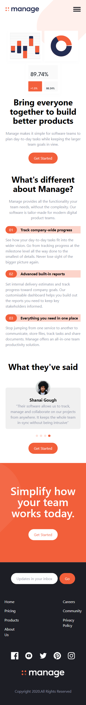
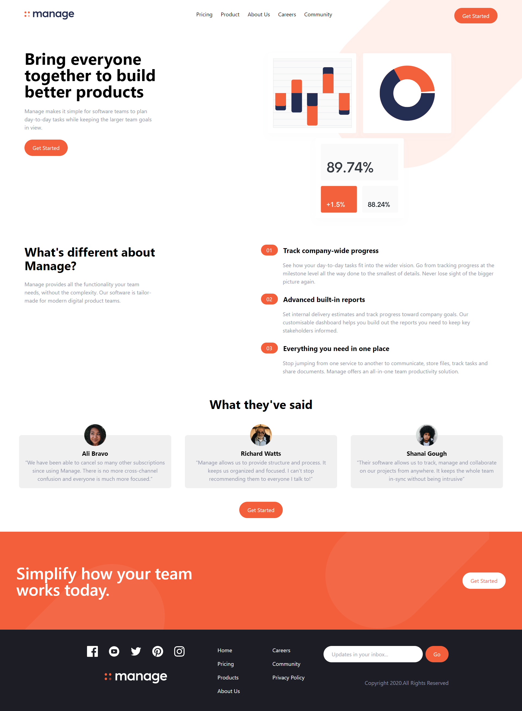

# Frontend Mentor - Manage landing page solution

This is a solution to the [Manage landing page challenge on Frontend Mentor](https://www.frontendmentor.io/challenges/manage-landing-page-SLXqC6P5). Frontend Mentor challenges help you improve your coding skills by building realistic projects.

## Overview

### The challenge

Users should be able to:

- View the optimal layout for the site depending on their device's screen size
- See hover states for all interactive elements on the page
- See all testimonials in a horizontal slider

### Screenshot

|       Mobile View        |       Desktop View        |
| :----------------------: | :-----------------------: |
|  |  |

## My process

### Built with

- Tailwind CSS
- Flexbox
- Mobile-first workflow
- **Slider** is build using [SwiperJS](https://swiperjs.com/) 🙌

### What I learned

I learned how to make full Layouts using Tailwind css. This project made me realize the true potential and benefits of using tailwind css. Tailwind can really speed up the development process once you get hang of it.

### Useful resources

- [Tailwind Crash Course 🔥](https://www.youtube.com/watch?v=dFgzHOX84xQ&t=3631s) - This video by **Brad Traversy** helped me learn tailwind in such a short period of time, highly recommended 🚀
- [Tailwind Docs](https://tailwindcss.com/docs/installation) - One of the easy to use and clean documentation ✨
